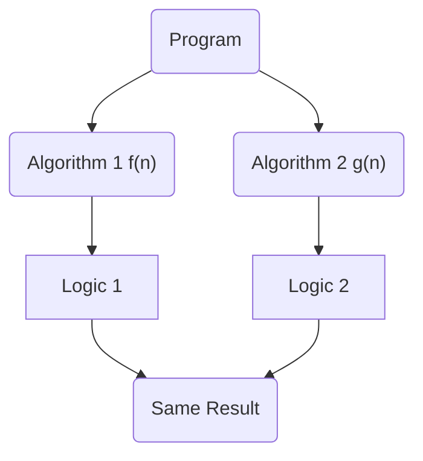

# Big O Notation "O" ✰✰✰

A function $f(n)$ is said to be $O(g(n))$ if there exists a positive constant $c$ and $k$ such that function $f(n)$
is always less than or equal to $c \cdot g(n)$ with multiplication of some constant $c$ for all the input values of $n$ where
$n$ is greater than or equal to some constant $k$ and constant $c$ is greater than zero.

### Mathematically

$f(n) = O(g(n)) \iff \exists \ c$, $k > 0$ such that $f(n) \leq c \cdot g(n)\ \forall \ n \geq k$, $c > 0$

 

$f(n) = O(g(n))$

$g(n)$ is a upper bound to $f(n)$

 

<Mer>

</Mer>

$c = 1$

$k = 4$

$f(n) = O(g(n)) \iff \geq c . g(n), \forall n \geq k$

$n^2$ ( *Lower growth rate function* ) $=$ $O(2^n)$ ( *Upper growth rate function* ) $\forall \ n \geq 4$

<Alert title="Note">
    Lower growth rate $func^c$ ( *Only for large value of input data* ) = $O($ Upper growth rate $func^c)$     
</Alert>

---

## Dominance Ranking

$$
n^m \geq n^2 \geq n! \geq 3^n \geq 2^n \geq n^3 \geq n^2 \geq n \ log \ n \geq n \geq log \ n \geq log \ log \ n \geq 1
$$

All values are equal for any $k$ point.

$$
log^3 \ n = log \ n * log \ n * log \ n = (log \ n)^3
$$

<Cola title="Identify True and False">

$n = O(n^2)$ `TRUE`

$n^1/2 = O(n)$ `TRUE`

$n^3 = O(n^2)$ `FALSE`

$n \ log \ n = O(n)$ `FALSE`

$n^2 = O(n \ log \ n)$ `FALSE`

$n \ log \ n = O(n^2 \ log \ n)$ `TRUE`

$n = O(log^9 \ n)$ `FALSE`

$log^9 \ n = O(n)$ `TRUE`

$log \ log \ n = O(log \ n)$ `TRUE`

$n^3 = O(2^n)$ `TRUE`

$2^n = O(3^n)$ `TRUE`

$3^n = O(n^n)$ `TRUE`

$log \ n^3 = O(n)$ `TRUE`

</Cola>