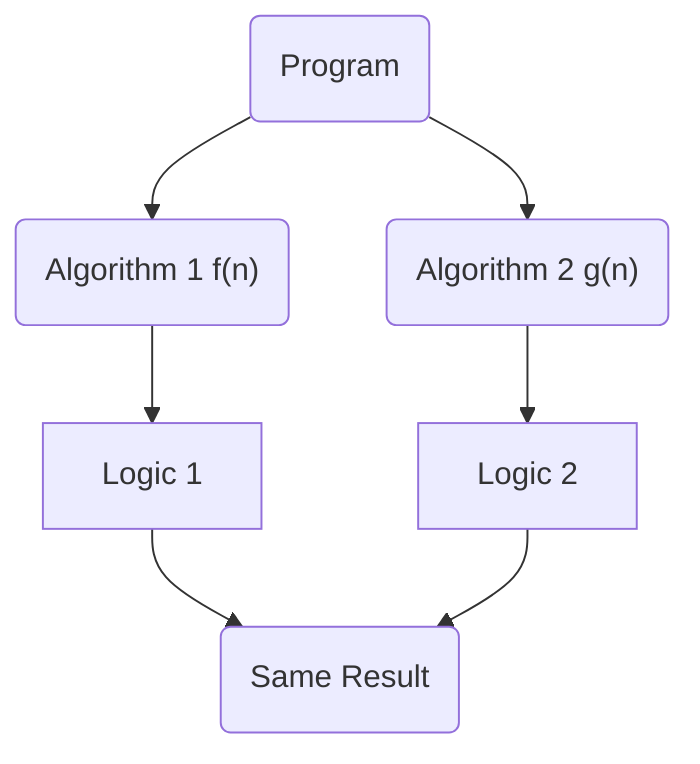

# Asymptotic Notation

To compare two algorithms rate of growth with respect to time and space, we need to use Asymptotic Notation.

<Cola title="Symbols and Meaning">

`iff` if and only if

`∀` for all

`∃` there exists

`∈` is an element of

`∉` is not an element of

`∅` empty set

`∞` infinity

`Θ` Theta

`Ω` Omega

</Cola>

 

1. **Big O Notation "O"** - Upper Bound ( *Worst Case* ) ✰✰✰
2. **Omega Notation "Ω"** - Lower Bound ( *Best Case* )
3. **Theta Notation "Θ"** - Tight Bound ( *Average Case* )
4. **Little O Notation "o"** ✰
5. **Little Omega Notation "ω"**

 

## Big O Notation "O" ✰✰✰

A function $f(n)$ is said to be $O(g(n))$ if there exists a positive constant $c$ and $k$ such that function $f(n)$
is always less than or equal to $c \cdot g(n)$ with multiplication of some constant $c$ for all the input values of $n$ where
$n$ is greater than or equal to some constant $k$ and constant $c$ is greater than zero.

### Mathematically

$f(n) = O(g(n)) \iff \exists \ c$, $k > 0$ such that $f(n) \leq c \cdot g(n)\ \forall \ n \geq k$, $c > 0$

 

$f(n) = O(g(n))$

$g(n)$ is a upper bound to $f(n)$

 

<Mer>

</Mer>
