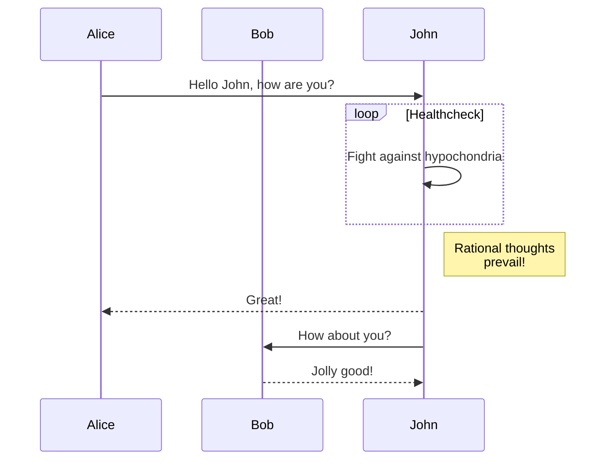
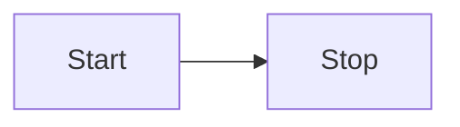

# Headingone

GOAT is an American online platform offering sneakers, luxury apparel and accessories through primary and resale markets. Founded in 2015, GOAT has 50 million members and 1,000,000 sellers across 170 countries on its platform. Wikipedia

GOAT is an American online platform offering sneakers, luxury apparel and accessories through primary and resale markets. Founded in 2015, GOAT has 50 million members and 1,000,000 sellers across 170 countries on its platform. Wikipedia

GOAT is an American online platform offering sneakers, luxury apparel and accessories through primary and resale markets. Founded in 2015, GOAT has 50 million members and 1,000,000 sellers across 170 countries on its platform. Wikipedia

# Headingtwo

<CodeS>
```tsx
// Custom copy label

function Button() {
  return <button>Click me</button>;
}
```
</CodeS>

<CodeM fileNames={["Main", "Short"]} exp>
```tsx
import { CodeHighlightTabs } from '@mantine/code-highlight';
import { TypeScriptIcon, CssIcon } from '@mantinex/dev-icons';

const tsxCode = `
function Button() {
  return <button>Click me</button>;
}
`;

const cssCode = `
.button {
  background-color: transparent;
  color: var(--mantine-color-blue-9);
}
`;

function Demo() {
  const tsIcon = <TypeScriptIcon size={18} />;
  const cssIcon = <CssIcon size={18} />;

  return (
    <CodeHighlightTabs
      code={[
        {
          fileName: 'Button.tsx',
          code: tsxCode,
          language: 'tsx',
          icon: tsIcon,
        },
        {
          fileName: 'Button.module.css',
          code: cssCode,
          language: 'scss',
          icon: cssIcon,
        },
      ]}
    />
  );
}
```

```tsx
// Custom copy label

function Button() {
  return <button>Click me</button>;
}
```
</CodeM>

<Mer>

</Mer>

---

<Mer>

</Mer>


## Sub Boy

GOAT is an American online platform offering sneakers, luxury apparel and accessories through primary and resale markets. Founded in 2015, GOAT has 50 million members and 1,000,000 sellers across 170 countries on its platform. Wikipedia

GOAT is an American online platform offering sneakers, luxury apparel and accessories through primary and resale markets. Founded in 2015, GOAT has 50 million members and 1,000,000 sellers across 170 countries on its platform. Wikipedia

GOAT is an American online platform offering sneakers, luxury apparel and accessories through primary and resale markets. Founded in 2015, GOAT has 50 million members and 1,000,000 sellers across 170 countries on its platform. Wikipedia

# Headingthree

GOAT is an American online platform offering sneakers, luxury apparel and accessories through primary and resale markets. Founded in 2015, GOAT has 50 million members and 1,000,000 sellers across 170 countries on its platform. Wikipedia

GOAT is an American online platform offering sneakers, luxury apparel and accessories through primary and resale markets. Founded in 2015, GOAT has 50 million members and 1,000,000 sellers across 170 countries on its platform. Wikipedia

GOAT is an American online platform offering sneakers, luxury apparel and accessories through primary and resale markets. Founded in 2015, GOAT has 50 million members and 1,000,000 sellers across 170 countries on its platform. Wikipedia

GOAT is an American online platform offering sneakers, luxury apparel and accessories through primary and resale markets. Founded in 2015, GOAT has 50 million members and 1,000,000 sellers across 170 countries on its platform. Wikipedia

GOAT is an American online platform offering sneakers, luxury apparel and accessories through primary and resale markets. Founded in 2015, GOAT has 50 million members and 1,000,000 sellers across 170 countries on its platform. Wikipedia

GOAT is an American online platform offering sneakers, luxury apparel and accessories through primary and resale markets. Founded in 2015, GOAT has 50 million members and 1,000,000 sellers across 170 countries on its platform. Wikipedia

GOAT is an American online platform offering sneakers, luxury apparel and accessories through primary and resale markets. Founded in 2015, GOAT has 50 million members and 1,000,000 sellers across 170 countries on its platform. Wikipedia

GOAT is an American online platform offering sneakers, luxury apparel and accessories through primary and resale markets. Founded in 2015, GOAT has 50 million members and 1,000,000 sellers across 170 countries on its platform. Wikipedia

GOAT is an American online platform offering sneakers, luxury apparel and accessories through primary and resale markets. Founded in 2015, GOAT has 50 million members and 1,000,000 sellers across 170 countries on its platform. Wikipedia

GOAT is an American online platform offering sneakers, luxury apparel and accessories through primary and resale markets. Founded in 2015, GOAT has 50 million members and 1,000,000 sellers across 170 countries on its platform. Wikipedia

GOAT is an American online platform offering sneakers, luxury apparel and accessories through primary and resale markets. Founded in 2015, GOAT has 50 million members and 1,000,000 sellers across 170 countries on its platform. Wikipedia

GOAT is an American online platform offering sneakers, luxury apparel and accessories through primary and resale markets. Founded in 2015, GOAT has 50 million members and 1,000,000 sellers across 170 countries on its platform. Wikipedia

GOAT is an American online platform offering sneakers, luxury apparel and accessories through primary and resale markets. Founded in 2015, GOAT has 50 million members and 1,000,000 sellers across 170 countries on its platform. Wikipedia

GOAT is an American online platform offering sneakers, luxury apparel and accessories through primary and resale markets. Founded in 2015, GOAT has 50 million members and 1,000,000 sellers across 170 countries on its platform. Wikipedia

GOAT is an American online platform offering sneakers, luxury apparel and accessories through primary and resale markets. Founded in 2015, GOAT has 50 million members and 1,000,000 sellers across 170 countries on its platform. Wikipedia

### Night

GOAT is an American online platform offering sneakers, luxury apparel and accessories through primary and resale markets. Founded in 2015, GOAT has 50 million members and 1,000,000 sellers across 170 countries on its platform. Wikipedia

GOAT is an American online platform offering sneakers, luxury apparel and accessories through primary and resale markets. Founded in 2015, GOAT has 50 million members and 1,000,000 sellers across 170 countries on its platform. Wikipedia

GOAT is an American online platform offering sneakers, luxury apparel and accessories through primary and resale markets. Founded in 2015, GOAT has 50 million members and 1,000,000 sellers across 170 countries on its platform. Wikipedia

GOAT is an American online platform offering sneakers, luxury apparel and accessories through primary and resale markets. Founded in 2015, GOAT has 50 million members and 1,000,000 sellers across 170 countries on its platform. Wikipedia

GOAT is an American online platform offering sneakers, luxury apparel and accessories through primary and resale markets. Founded in 2015, GOAT has 50 million members and 1,000,000 sellers across 170 countries on its platform. Wikipedia

GOAT is an American online platform offering sneakers, luxury apparel and accessories through primary and resale markets. Founded in 2015, GOAT has 50 million members and 1,000,000 sellers across 170 countries on its platform. Wikipedia
