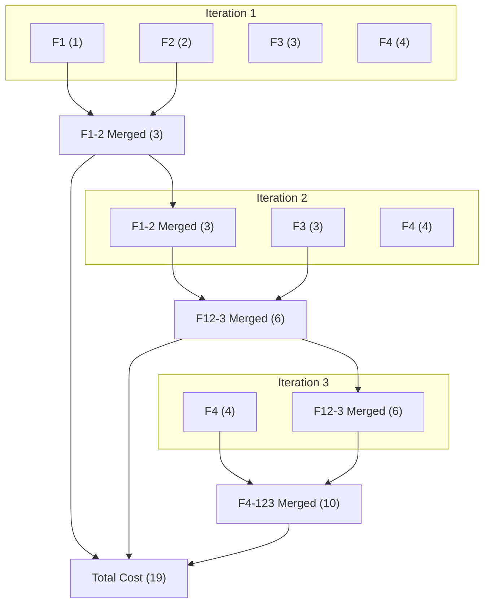
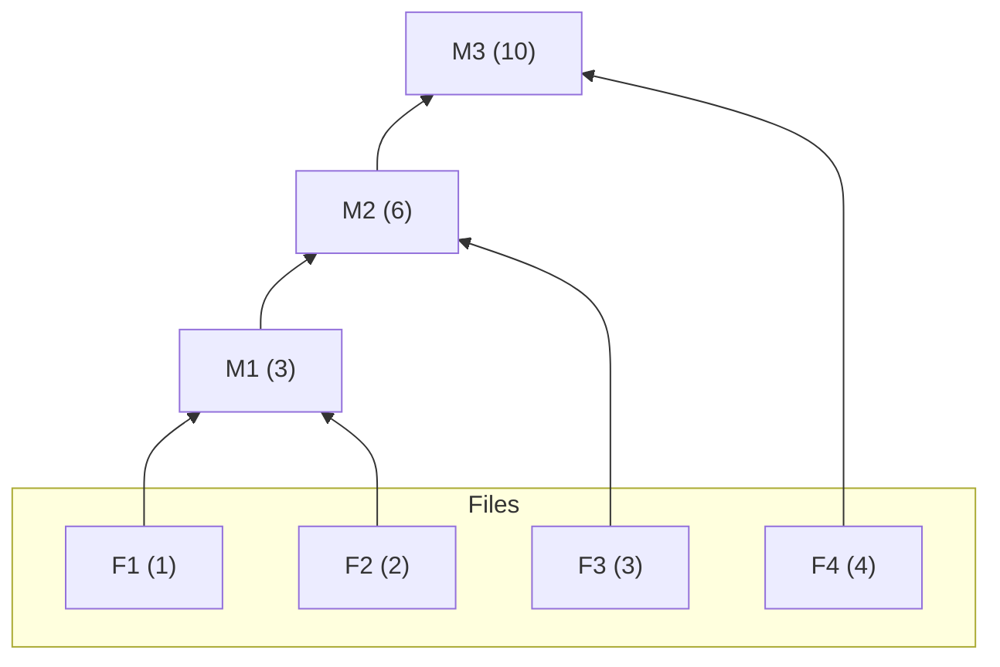
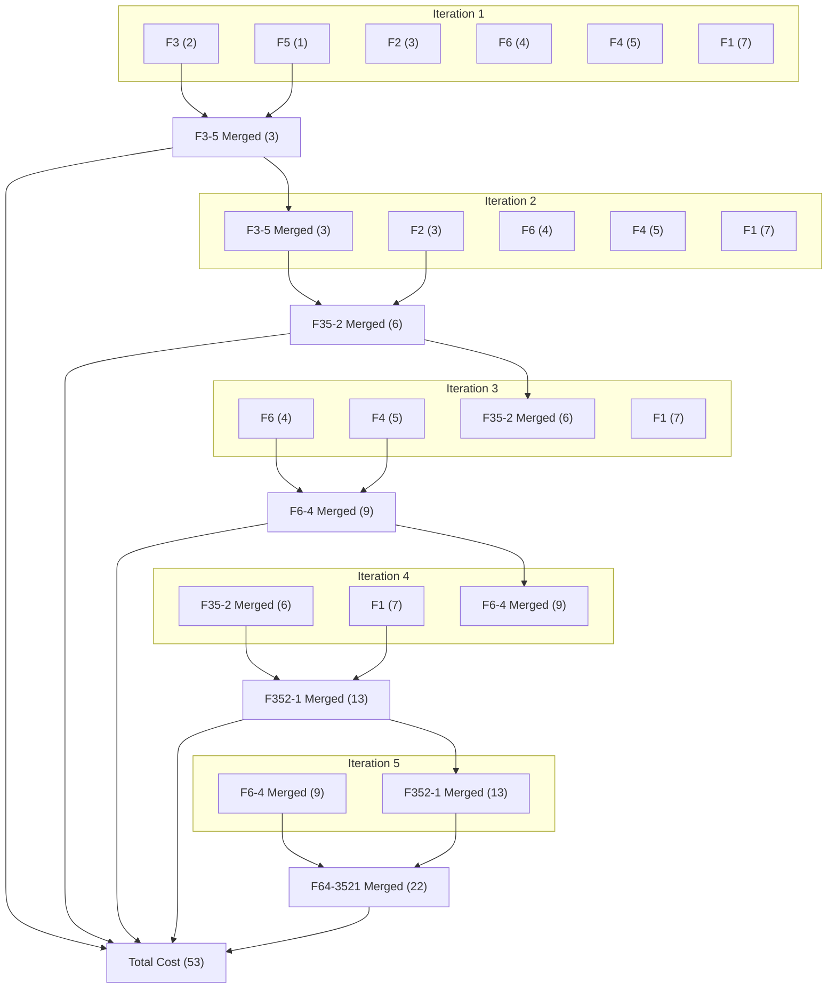
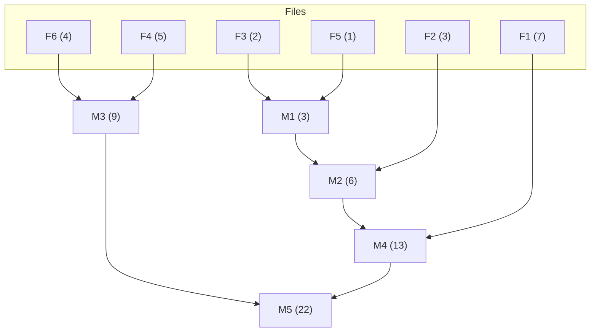
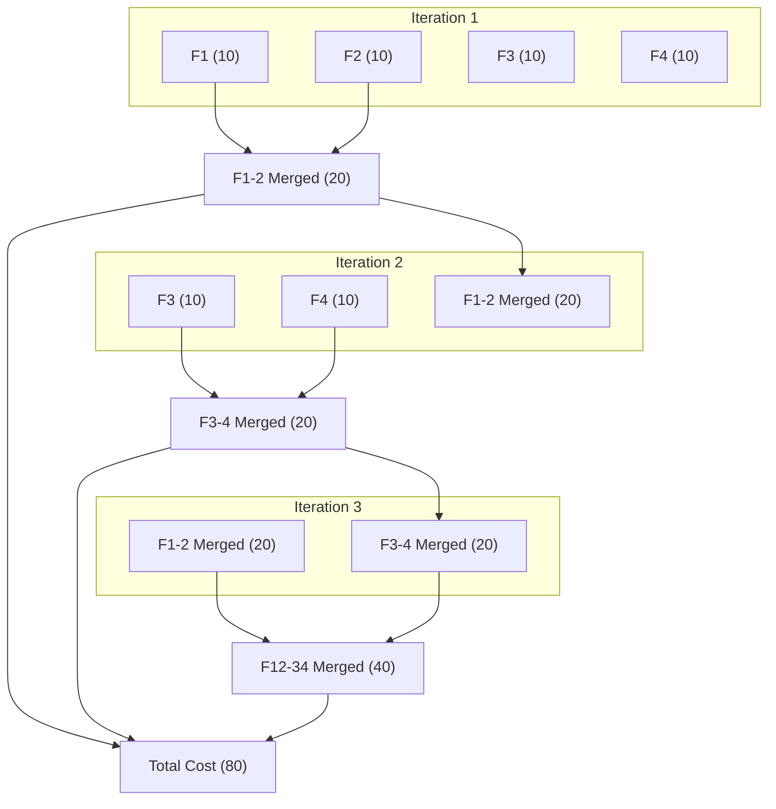
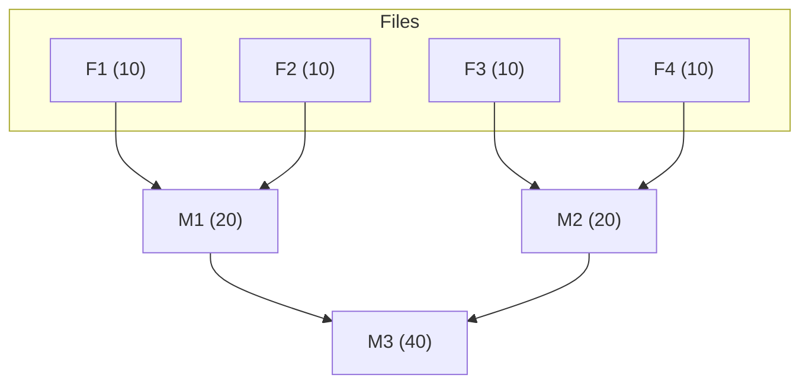
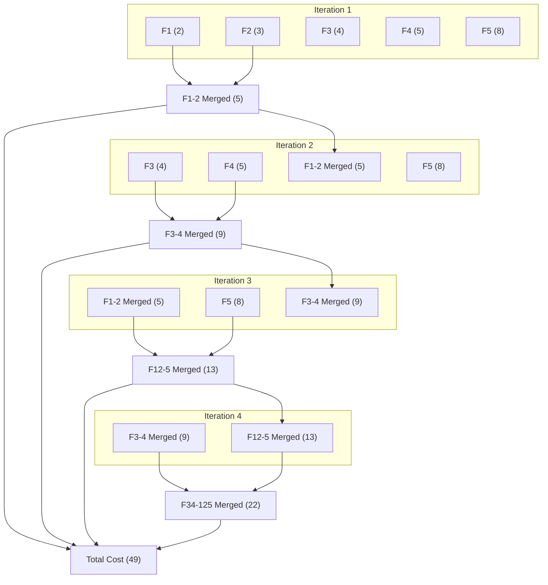
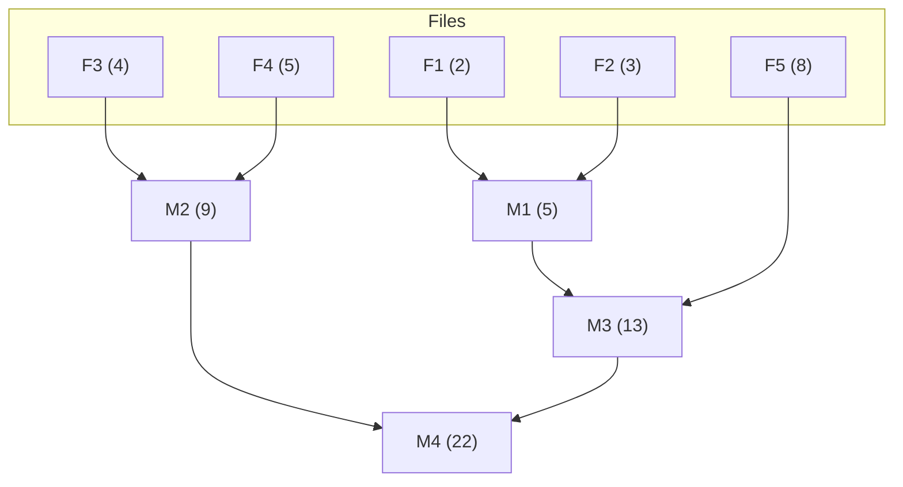
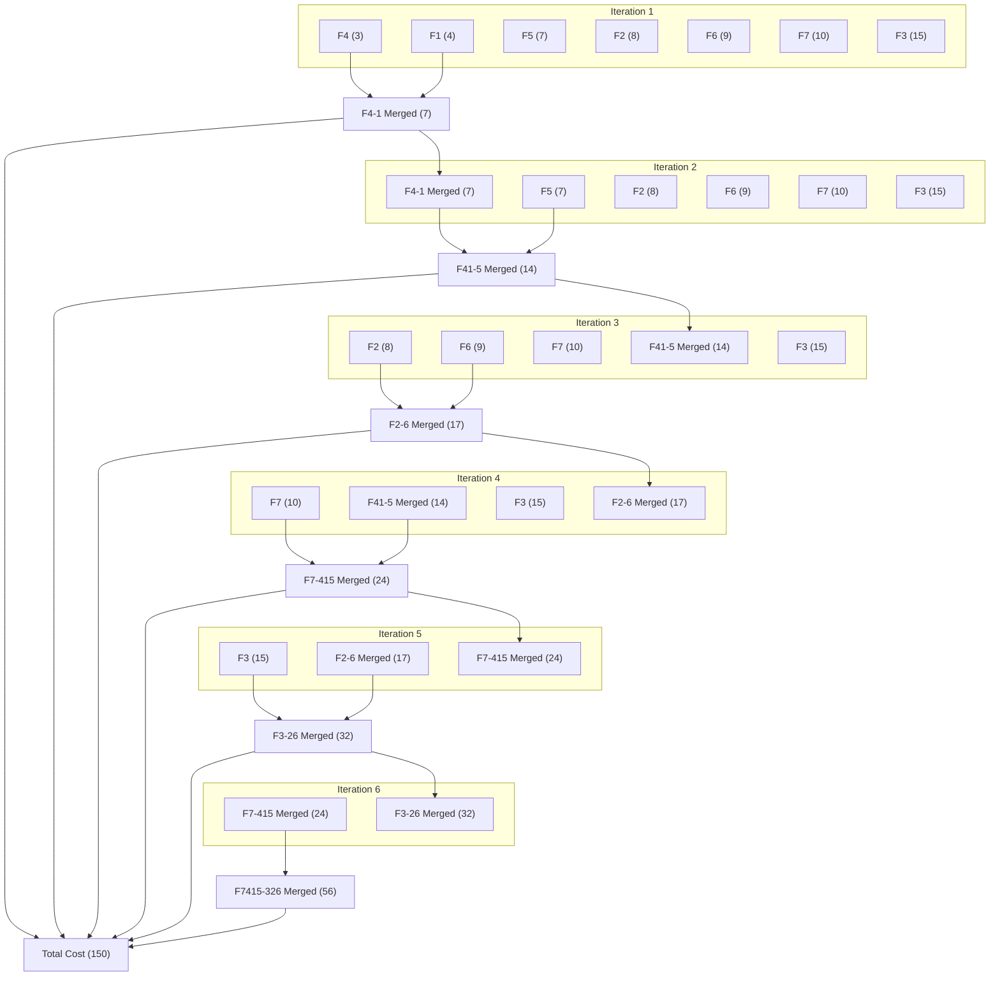
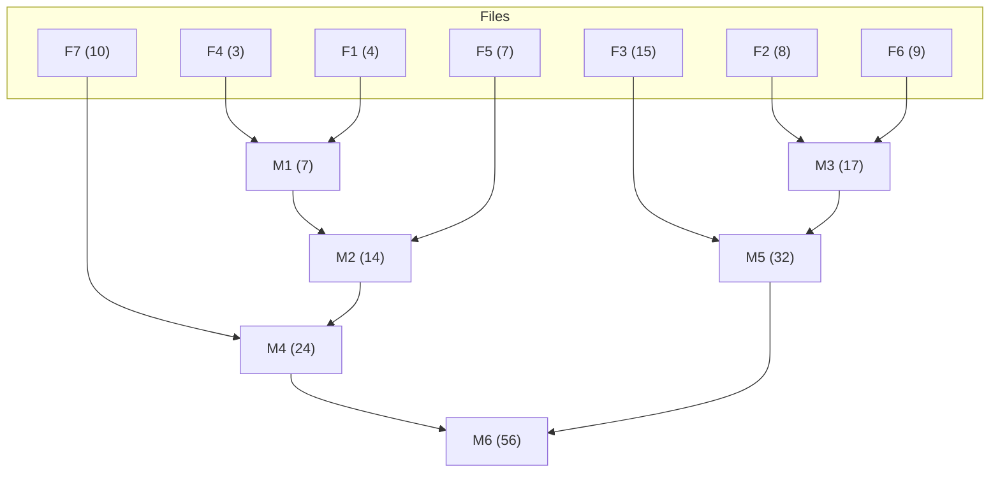

# Optimal Merge Pattern

In the realm of algorithms, the optimal merge pattern refers to the most efficient way to merge a collection of sorted files into a single, final sorted file. This efficiency is measured by the total time or number of comparisons required for the merging process.

## Why It Matters

- **Efficiency:** Merging is a fundamental operation in various algorithms, and finding the optimal pattern minimizes the overall execution time.
- **Real-world Applications:** This concept is particularly relevant in scenarios like merging sorted data from multiple sources, external files, or database tables.

## Understanding the Problem

- **Input:** A set of `n` sorted files, where each file has a specific size.
- **Goal:** Merge these files into a single sorted file, minimizing the total cost of comparisons or time spent merging.

## Key Points and Strategies

### Greedy Approach

This is the most common and effective method for finding the optimal merge pattern. It involves merging the two smallest files at each step. This strategy minimizes the immediate cost of merging because smaller files require fewer comparisons.

#### Rationale

Selecting the two largest files for initial merging might seem faster initially, but it can lead to larger intermediate files later, increasing the overall cost.

### Implementation with Priority Queue

- A priority queue (min-heap) is a perfect data structure for maintaining the files sorted by size.
- At each step:
  - Extract the two files with the smallest sizes from the priority queue.
  - Merge them into a new sorted file.
  - Calculate the cost of merging (usually proportional to the sum of their sizes).
  - Update the cost and add the newly merged file back to the priority queue.

- This process continues until only one file remains in the queue, which is the final sorted output.

## Time Complexity Analysis

- The time complexity using the greedy approach with a priority queue is proven to be O(n log n), where `n` is the total number of files.
- This complexity arises from the logarithmic operations involved in maintaining the priority queue (inserting/deleting elements).

## Comparison with Other Approaches

- **Naive Approach:** Merging files sequentially, one pair at a time, can lead to suboptimal results.
- **Optimal Merge Pattern:** Guarantees the minimum total cost for merging in most cases.

## Additional Considerations

- While the optimal merge pattern is provably efficient, the actual cost can vary depending on the specific file sizes and implementation details.
- In practice, if the difference in file sizes is not significant, simpler merging strategies might be preferable due to constant factors associated with priority queue operations.

## Numericals

### Steps to solve

1. **Identify File Sizes:** The problem statement will usually provide a list of file sizes (`F1`, `F2`, ..., `Fn`) representing the sorted files you need to merge.

2. **Apply Greedy Approach:** 

At each step:
   - Use a priority queue (min-heap) to efficiently keep track of the files based on their sizes (smaller at the top).
   - Extract the two files with the smallest sizes (`f1` and `f2`) from the queue.
   - Calculate the cost of merging them, which is typically the sum of their sizes (`cost = f1 + f2`).
   - Merge `f1` and `f2` into a new sorted file (`merged_file`).
   - Update the total cost by adding `cost`.
   - Add `merged_file` (with its combined size) back to the priority queue.

3. **Repeat Merging:** Continue steps 2(a) to 2(e) until only one file remains in the priority queue. This final file is the merged result.

4. **Calculate Total Cost:** The total cost you accumulated throughout the merging process represents the minimum number of comparisons required for optimal merging.

5. **Verification:** Under the optimal merge pattern concept the total number of record
movement is.

$$
\displaystyle\sum_{i=1}^n di \times li
$$

`di` is distance from root node to that particular ith node

`li` is length of that particular ith node

### Example

<Divider label="1" labelPosition="left" />

#### Problem 

Find the optimal merge pattern and the total cost of merging these files.

- `F1 = 1`
- `F2 = 2`
- `F3 = 3`
- `F4 = 4`

#### Solution

<MerM title={["Detailed", "Brief"]}>

</MerM>

- Optimal Merge Pattern: `F1-2`, `F12-3`, `F4-123`
- Optimal Cost: `19`
- Final Merged File: `M3 (10)`

#### Verification:

- Use `Brief` diagram to count the number of record movements.

- The total number of record movements is calculated as follows:

$$
(di_{F1} \times li_{F1}) + (di_{F2} \times li_{F2}) + \dotsc = \displaystyle\sum_{i=1}^n di \times li
$$

$$
(1 \times 3) + (2 \times 3) + (3 \times 2) + (4 \times 1) = 19
$$

#### Key Points:

- Remember, the priority queue ensures you always merge the two smallest files first.
- The total cost calculated during merging represents the optimal cost for this specific set of file sizes.

<Divider label="2" labelPosition="left" />

#### Problem 

You're given six sorted files with the following sizes:

- `F1 = 7`
- `F2 = 3`
- `F3 = 2`
- `F4 = 5`
- `F5 = 1`
- `F6 = 4`

Find the optimal merge pattern and the total cost of merging these files.

#### Solution:

<MerM title={["Detailed", "Brief"]}>

</MerM>

- Optimal Merge Pattern: `F3-5`, `F35-2`, `F6-4`, `F352-1`, `F64-3521`
- Optimal Cost: `53`
- Final Merged File: `M5 (22)`

#### Verification:

- Use `Brief` diagram to count the number of record movements.

- The total number of record movements is calculated as follows:

$$
(4 \times 2) + (5 \times 2) + (2 \times 4) + (1 \times 4) + (3 \times 3) + (7 \times 2) = 53
$$

<Divider label="3" labelPosition="left" />

#### Problem

You have four sorted files, all with the same size of `10` units each. Find the optimal merge pattern and total cost.

#### Solution

<MerM title={["Detailed", "Brief"]}>

</MerM>

- Optimal Merge Pattern: `F1-2`, `F3-4`, `F12-34`
- Optimal Cost: `80`
- Final Merged File: `M3 (40)`

#### Verification:

- Use `Brief` diagram to count the number of record movements.

- The total number of record movements is calculated as follows:

$$
(10 \times 2) + (10 \times 2) + (10 \times 2) + (10 \times 2) = 80
$$

#### Key Observation

- Even though all files have the same size, the optimal merge pattern still involves merging the smallest files first to minimize the total cost.

<Divider label="4" labelPosition="left" />

#### Problem

You're given five sorted files with the following sizes:

- `F1 = 2`
- `F2 = 3`
- `F3 = 4`
- `F4 = 5`
- `F5 = 8`

Find the optimal merge pattern and the total cost of merging these files.

#### Solution

<MerM title={["Detailed", "Brief"]}>

</MerM>

- Optimal Merge Pattern: `F1-2`, `F3-4`, `F12-5`, `F34-125`
- Optimal Cost: `49`
- Final Merged File: `M4 (22)`

#### Verification:

- Use `Brief` diagram to count the number of record movements.

- The total number of record movements is calculated as follows:

$$
(4 \times 2) + (5 \times 2) + (2 \times 3) + (3 \times 3) + (8 \times 2) = 49
$$

<Divider label="5" labelPosition="left" />

#### Problem

You have three sorted files with the following sizes:

- `F1 = 4`
- `F2 = 8`
- `F3 = 15`
- `F4 = 3`
- `F5 = 7`
- `F6 = 9`
- `F7 = 10`

Find the optimal merge pattern and the total cost of merging these files.

#### Solution

<MerM title={["Detailed", "Brief"]}>

</MerM>

- Optimal Merge Pattern: `F4-1`, `F41-5`, `F2-6`, `F7-415`, `F3-26`, `F7415-326`
- Optimal Cost: `150`
- Final Merged File: `M6 (56)`

#### Verification:

- Use `Brief` diagram to count the number of record movements.

- The total number of record movements is calculated as follows:

$$
(3 \times 4) + (4 \times 4) + (7 \times 3) + (8 \times 3) + \\ (9 \times 2) + (10 \times 2) + (15 \times 1) = 150
$$

## Questions

<Cola title="Describe an efficient way to merge k sorted files into a single sorted file in a distributed computing environment.">
The optimal merge pattern refers to the most efficient way to merge multiple sorted files into a single sorted file. It's about minimizing the total number of comparisons or operations needed during the merging process.

Here's the key idea:

* We can merge sorted files in pairs. Each pair-wise merge takes time proportional to the total size of the two files being merged.
* But, the order in which we choose these pairs can significantly impact the overall efficiency.

The optimal merge pattern aims to strategically select these pairs to minimize the total merging time. It achieves this by prioritizing merging the smallest files first.

There are two main approaches to find the optimal merge pattern:

1. **Greedy Method:** This method repeatedly identifies the two smallest files (based on size) from the remaining ones and merges them. The resulting merged file is then added back to the pool for further merging. This process continues until only one file remains, which is the final sorted output.

2. **Using a Binary Merge Tree:** We can construct a binary tree where each leaf node represents a sorted file and its size. The weight of each internal node represents the total size of the files in its subtree (which essentially reflects the merging cost). The optimal pattern corresponds to a binary merge tree with the minimum total weight across all internal nodes.

By following the optimal merge pattern, we can significantly reduce the number of comparisons needed during the merging process compared to a random or non-strategic approach. This translates to faster sorting of the combined data.
</Cola>