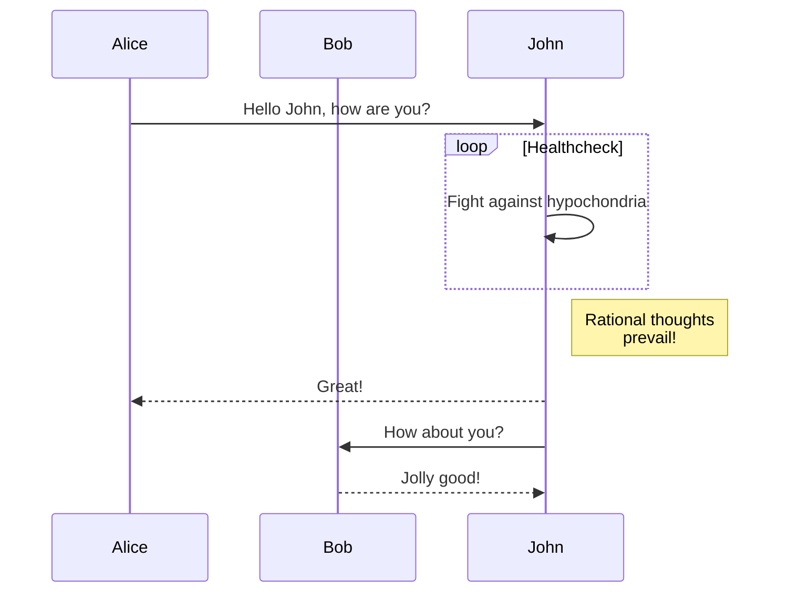

# Milky Way

Once done, you must run the following command to configure Lucid. You can optionally specify the database dialect you want to use using the `--db` flag. Following is the list of valid options.

- `sqlite`
- `postgres`
- `mysql`
- `mssql`

[disconnection method](https://github.com/adonisjs/lucid/blob/develop/src/connection/index.ts#L365)


<Cola title="Ecample">

A fluent query builder built on top of Knex.
Support for read-write replicas and multiple connection management.
Class-based models that adhere to the active record pattern.
Migration system to modify database schema using incremental changesets.
Model factories to generate fake data for testing.
Database seeders to insert initial/dummy data into the database.

<CodeS>
```tsx
// Custom copy label

function Button() {
  return <button>Click me</button>;
}
```
</CodeS>

</Cola>


<CodeM fileNames={["Main", "Short"]} exp>
```tsx
import { CodeHighlightTabs } from '@mantine/code-highlight';
import { TypeScriptIcon, CssIcon } from '@mantinex/dev-icons';

const tsxCode = `
function Button() {
  return <button>Click me</button>;
}
`;

const cssCode = `
.button {
  background-color: transparent;
  color: var(--mantine-color-blue-9);
}
`;

function Demo() {
  const tsIcon = <TypeScriptIcon size={18} />;
  const cssIcon = <CssIcon size={18} />;

  return (
    <CodeHighlightTabs
      code={[
        {
          fileName: 'Button.tsx',
          code: tsxCode,
          language: 'tsx',
          icon: tsIcon,
        },
        {
          fileName: 'Button.module.css',
          code: cssCode,
          language: 'scss',
          icon: cssIcon,
        },
      ]}
    />
  );
}
```

```tsx
// Custom copy label

function Button() {
  return <button>Click me</button>;
}
```
</CodeM>

<Mer>

</Mer>

---

<Mer>

</Mer>


## The Milky Way Galaxy The Milky Way Galaxy

The Milky Way is our cosmic home, a vast and majestic spiral galaxy teeming with stars, dust, gas, and mysterious dark matter. Here's a detailed look at its structure, composition, and place in the universe:

### Structure

* **Barred Spiral:** The Milky Way is classified as a barred spiral galaxy, characterized by a central bulge, a flattened disk with spiral arms, and a surrounding halo. 
* **Central Bulge:** The bulge is a densely packed region of stars, containing a supermassive black hole called Sagittarius A* at its core. This black hole is millions of times more massive than our Sun.
* **Disk:** The disk is a flattened plane where most of the galaxy's stars and gas reside, including our Sun. The spiral arms originate from the disk and are thought to be regions of ongoing star formation.  
* **Halo:** The halo is a spherical cloud of stars, gas, and dark matter that extends far beyond the visible disk. 

### Composition

* **Stars:** The Milky Way is estimated to contain 200-400 billion stars, ranging from massive blue giants to faint red dwarfs. Our Sun is a typical yellow dwarf star located on one of the spiral arms.
* **Dust and Gas:** Interstellar dust and gas, mostly composed of hydrogen and helium, permeate the disk and halo. These clouds are the raw materials for new star and planetary system formation. 
* **Dark Matter:** Dark matter is an invisible form of matter that is thought to make up most of the galaxy's mass.  While its exact nature remains a mystery, its gravitational influence plays a crucial role in holding the Milky Way together. 

### Age and Size

* **Ancient:** The Milky Way is estimated to be around 13.6 billion years old, making it one of the oldest galaxies in the observable universe. 
* **Vast:** The Milky Way is a colossal structure, with a diameter of roughly 100,000 light-years. Our Sun resides about 25,000 light-years from the galactic center.

### Galactic Neighborhood

* **Local Group:** The Milky Way is not an isolated island in space. It belongs to a group of galaxies called the Local Group, which includes our closest large galactic neighbor, the Andromeda Galaxy.
* **Collision Course:** Interestingly, the Milky Way and Andromeda are slowly moving towards each other and are predicted to collide in a few billion years. This event would eventually form a giant elliptical galaxy.

The Milky Way continues to be a subject of active research, with astronomers unraveling its mysteries through powerful telescopes and sophisticated computer simulations. As we delve deeper into our galactic home, we gain a greater appreciation for our place in the vast and ever-expanding universe.
